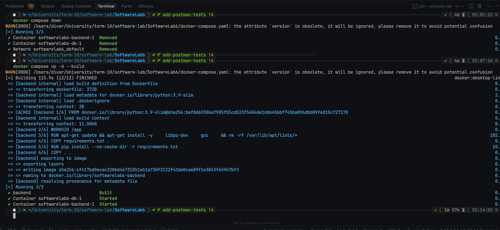
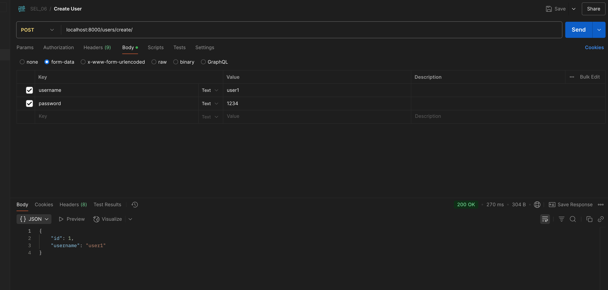
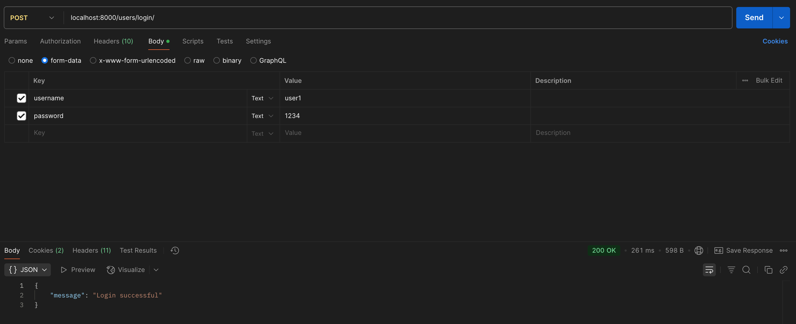
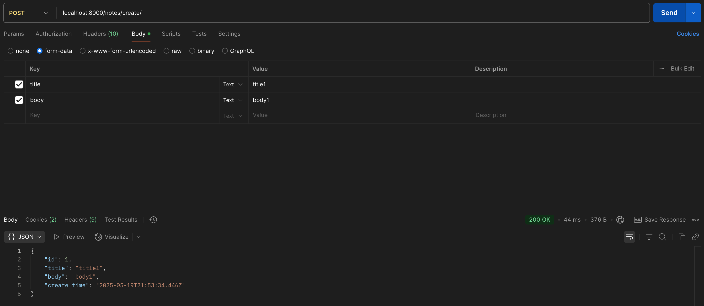
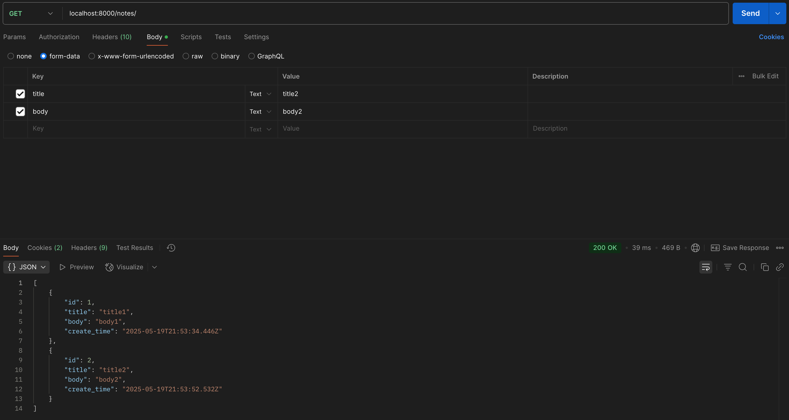
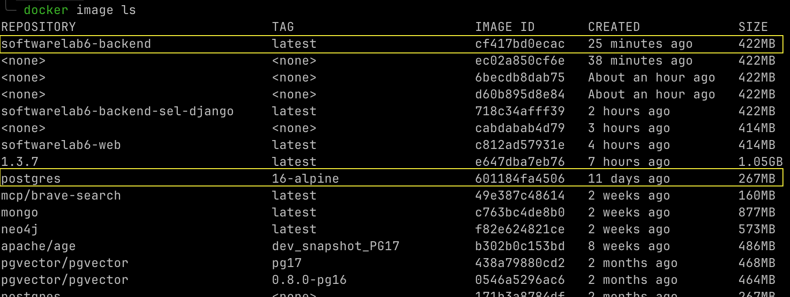
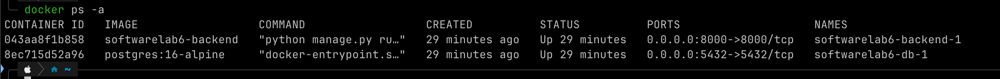
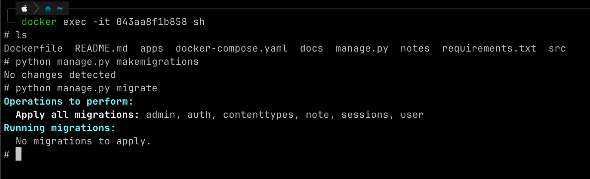

# آزمایش ۶ نرم افزار (کار با داکر و میکروسرویس)

## بخش اول: استقرار پروژه

فایل `Dockerfile` و `docker-compose.yaml` ایجاد شده‌اند.

### توضیحات `Dockerfile`

فایل `Dockerfile` دستورالعمل‌های ساخت ایمیج داکر برای وب‌سرور پروژه را مشخص می‌کند:

-   `FROM python:3.9-slim`: ایمیج پایه پایتون نسخه ۳.۹ نسخه slim به عنوان نقطه شروع انتخاب می‌شود.
-   `WORKDIR /app`: دایرکتوری کاری داخل کانتینر را `/app` تنظیم می‌کند.
-   `RUN apt-get update && apt-get install -y libpq-dev gcc && rm -rf /var/lib/apt/lists/*`: پکیج‌های مورد نیاز برای `psycopg2` (اتصال به PostgreSQL) و کامپایلر `gcc` را نصب می‌کند. سپس فایل‌های اضافی `apt` برای کاهش حجم ایمیج پاک می‌شوند.
-   `COPY requirements.txt .`: فایل `requirements.txt` از هاست به دایرکتوری کاری کانتینر کپی می‌شود.
-   `RUN pip install --no-cache-dir -r requirements.txt`: وابستگی‌های پایتون پروژه با استفاده از `pip` نصب می‌شوند. گزینه `--no-cache-dir` از ذخیره کش جلوگیری کرده و حجم ایمیج را کاهش می‌دهد.
-   `COPY . .`: تمامی فایل‌های پروژه از هاست به دایرکتوری کاری کانتینر کپی می‌شوند.
-   `EXPOSE 8000`: پورت ۸۰۰۰ کانتینر برای ارتباطات خارجی در دسترس قرار می‌گیرد.
-   `CMD ["python", "manage.py", "runserver", "0.0.0.0:8000"]`: دستوری که هنگام اجرای کانتینر به طور پیش‌فرض اجرا می‌شود و سرور جنگو را روی پورت ۸۰۰۰ و همه اینترفیس‌های شبکه (`0.0.0.0`) راه‌اندازی می‌کند.

### توضیحات `docker-compose.yaml`

فایل `docker-compose.yaml` برای تعریف و اجرای چندین سرویس داکر (در اینجا پایگاه‌داده و وب‌سرور) استفاده می‌شود:

-   `version: '3.8'`: نسخه مورد استفاده از `docker-compose` را مشخص می‌کند.
-   `services`: در این بخش سرویس‌های مختلف برنامه تعریف می‌شوند.
    -   `db`: سرویس پایگاه داده PostgreSQL.
        -   `image: postgres:16-alpine`: از ایمیج رسمی `postgres` نسخه ۱۶ با تگ `alpine` (نسخه سبک) استفاده می‌کند.
        -   `volumes: - postgres_data:/var/lib/postgresql/data/`: یک `volume` به نام `postgres_data` برای ذخیره پایدار داده‌های پایگاه‌داده ایجاد و به مسیر `/var/lib/postgresql/data/` داخل کانتینر متصل می‌کند.
        -   `environment`: متغیرهای محیطی برای تنظیم پایگاه‌داده (نام پایگاه‌داده، کاربر و رمز عبور) را تعریف می‌کند.
        -   `ports: - "5432:5432"`: پورت ۵۴۳۲ هاست را به پورت ۵۴۳۲ کانتینر پایگاه‌داده متصل (map) می‌کند.
        -   `networks: - django_network`: این سرویس را به شبکه `django_network` متصل می‌کند.
    -   `backend`: سرویس وب‌سرور جنگو.
        -   `build: .`: مشخص می‌کند که ایمیج این سرویس باید از `Dockerfile` موجود در دایرکتوری فعلی (`.`) ساخته شود.
        -   `volumes: - .:/app/`: دایرکتوری فعلی پروژه روی هاست را به دایرکتوری `/app/` داخل کانتینر متصل می‌کند. این امکان `hot-reloading` کد را فراهم می‌کند.
        -   `ports: - "8000:8000"`: پورت ۸۰۰۰ هاست را به پورت ۸۰۰۰ کانتینر وب‌سرور متصل می‌کند.
        -   `environment`: متغیرهای محیطی لازم برای اتصال به پایگاه‌داده و سایر تنظیمات برنامه را تعریف می‌کند.
        -   `depends_on: - db`: مشخص می‌کند که سرویس `backend` به سرویس `db` وابسته است و باید پس از آن اجرا شود.
        -   `networks: - django_network`: این سرویس را نیز به شبکه `django_network` متصل می‌کند.
-   `networks`: بخش تعریف شبکه‌های سفارشی.
    -   `django_network: driver: bridge`: یک شبکه `bridge` به نام `django_network` ایجاد می‌کند تا سرویس‌ها بتوانند با یکدیگر از طریق نام سرویس ارتباط برقرار کنند.
-   `volumes`: بخش تعریف `volume`های نام‌گذاری شده.
    -   `postgres_data: driver: local`: یک `volume` محلی به نام `postgres_data` برای نگهداری داده‌های پایگاه‌داده تعریف می‌کند.

## بخش دوم: ارسال درخواست به وب‌سرور

ابتدا به کمک داکر کامپوز کانتینر‌ها را بالا می‌آوریم:

سپس یوزر ۱ را می‌سازیم:

سپس با یوزر ۱ لاگین می‌کنیم:

سپس نوت ۱ و ۲ را می‌سازیم:

سپس نوت‌ها را لیست می‌کنیم:

## بخش سوم: تعامل با داکر

ابتدا ایمیج‌ها را نشان می‌دهیم، دو ایمیج مشخص شده مربوط به این پروژه هستند:

کانتینرها مطابق زیر هستند و هر دو مربوط به همین پروژه هستند:

حال در کانتینر مربوط به وب‌سرور `exec` می‌کنیم و همچنین شل `sh` را به آن می‌دهیم. با فلگ `-it` به صورت تعاملی در ترمینال میبینیم. همچنین حال که در کانتینر هستیم چند دستور مربوط به مایگریشن ران می‌کنیم:

## بخش چهارم: پرسش‌ها

### ۱- وظایف Dockerfile، image و container را توضیح دهید.

**Dockerfile**  
یک فایل متنی شامل دستورالعمل‌های ساخت Image داکر است. این فایل با دستوراتی مانند `FROM` (تعیین پایه Image)، `COPY` (کپی فایل‌ها)، `RUN` (اجرای دستورات نصب) و `CMD` (تعیین دستور پیش‌فرض اجرا) تنظیم می‌شود. هر دستور یک **لایه** در Image نهایی ایجاد می‌کند که بهینه‌سازی و کش‌شدن مراحل ساخت را ممکن می‌سازد.  

**Image**  
خروجی نهایی پردازش Dockerfile است. Image یک پکیج **غیرقابل تغییر** (Immutable) شامل کد برنامه، runtime، کتابخانه‌ها و تنظیمات است. این پکیج به عنوان الگویی ایستا عمل می‌کند که می‌توان از آن چندین Container ساخت. Imageها در رجیستری‌هایی مانند Docker Hub ذخیره و بین توسعه‌دهندگان به اشتراک گذاشته می‌شوند.  

**Container**  
نمونهِ در حال اجرا از یک Image است. Containerها محیطی **ایزوله** و سبک برای اجرای برنامه فراهم می‌کنند و دارای یک لایه نوشتنی موقت برای ذخیره تغییرات حین اجرا هستند. با توقف Container، این تغییرات از بین می‌روند مگر از Volumeها برای ذخیره داده‌های پایدار استفاده شود. هر Container چرخه حیات مستقلی دارد و از طریق دستوراتی مانند `docker run` یا `docker stop` مدیریت می‌شود.

### ۲- از kubernetes برای انجام چه کارهایی می‌توان استفاده کرد؟ رابطه آن با داکر چیست؟

**Kubernetes** یک پلتفرم **مدیریت کانتینرها در مقیاس بزرگ** است که برای **استقرار خودکار، مقیاس‌پذیری، و نظارت** بر برنامه‌های کانتینری استفاده می‌شود. این ابزار امکان اجرای هزاران کانتینر را در چندین سرور فراهم می‌کند، خرابی‌ها را تشخیص می‌دهد، بار ترافیک را توزیع می‌کند، و به‌روزرسانی‌ها را بدون اختلال در سرویس انجام می‌دهد.  

**Docker** ابزاری برای **ساخت و اجرای کانتینرها در سطح تک ماشین** است. توسعه‌دهندگان از آن برای بسته‌بندی برنامه‌ها در Imageها، تست محلی، و اجرای کانتینرها استفاده می‌کنند. Docker Compose نیز برای مدیریت چندین کانتینر در یک محیط لوکال کاربرد دارد.  

**رابطه این دو**: Kubernetes از Docker (یا سایر رانتایم‌ها) برای **اجرای کانتینرها** در خوشه‌های خود استفاده می‌کند. Docker وظیفه ساخت و اجرای اولیه کانتینرها را برعهده دارد، اما Kubernetes آن‌ها را در محیط‌های پیچیده و توزیعشده **اورکستراسیون** می‌کند. به عبارت دیگر، Docker "سازنده" کانتینرهاست و Kubernetes "مدیر" آن‌ها در مقیاس سازمانی.
